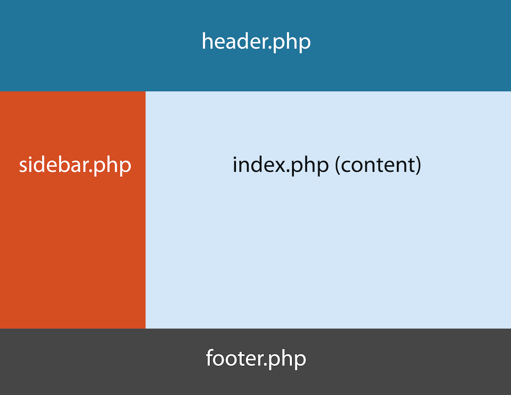

# WordPress theme files and folder structure

## WordPress page construction

WordPress is built to be flexible, and it builds the pages you see on the screen in blocks. A very common arrangement of these blocks includes the header.php, sidebar.php, index.php, and footer.php files, and looks like this:

## Template Hierarchy

Here is WordPress official Template Hierarchy, which is how a theme files structured: [Template Hierarchy](https://i0.wp.com/developer.wordpress.org/files/2023/10/template-hierarchy-scaled.jpeg?ssl=1)

## Files and Folder Structure

WordPress have several folder and files to have it's directory. A standard WordPress theme directory have these files and folder,

<pre>
mynewtheme (theme name)
|
|
|---📁assets
|    |
|    |----📁css
|	 |	 |----bootstrap.min.css
|    |   |----main.css
|    |
|    |----📁js
|	 |	 |----bootstrap.min.js
|    |   |----main.js
|	 |	 
|    |----📁media (for images, videos, and etc.)
|
|----📁inc
|
|----📁language
|
|----📁template-parts
|    |
|    |----📁post
|    |   |
|	 |	 |----content-none.php
|    |   |----content.php
|
|----📁templates
|
|----functions.php
|
|----index.php
|
|----header.php
|
|----footer.php
|
|----author.php
|
|----category.php
|
|----page.php
|
|----single.php
|
|----search.php
|
|----404.php
</pre>

## Theme Template Parts

Theme parts or Template Parts is some partial parts, which is common parts to many WordPres pages, these are,

* parts/
    * comments.html
    * footer.html
    * header.html
    * sidebar.html
